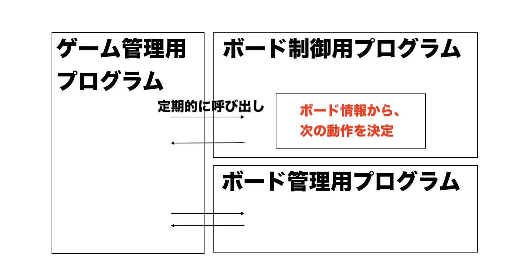

# Tetris Game

プログラミング学習を目的とした、ブロックを操作してスコアを競うゲームです

## 実行環境

#### Mac環境

Finder→Application→Utility→Terminalから、ターミナルを起動して以下コマンドを実行する。

```
# install pyqt5 and NumPy
brew install python3
pip3 install pyqt5
pip3 install numpy
# install other packages
brew install git
```

[doc/files/install_mac.md](./doc/files/install_mac.md)に上記手順を記載

#### Ubuntu環境

[doc/files/install_ubuntu.md](./doc/files/install_ubuntu.md)に手順を記載

#### docker環境

[docker/README.md](docker/README.md)に手順を記載

## 実行方法

本リポジトリを取得

```shell
git clone https://github.com/seigot/tetris_game
```

ゲーム開始用スクリプトを実行

```shell
cd tetris_game
bash start.sh
```


## ファイル構成

#### ファイル一覧

* `game_manager/game_manager.py` : ゲーム管理用プログラム
* `game_manager/board_model.py` : ボード管理用プログラム
* `board_controller.py` : ボード制御用プログラム（ブロックの操作は、このファイルを編集して下さい。）
* `start.sh` : ゲーム開始用スクリプト

#### 詳細

以下のような構成になっています。<br>
ボード制御用プログラムは、管理プログラムから定期的に呼び出されるので、ボード情報から次の動作を決定して下さい。 <br>



詳細は[こちら](doc/files/board_model.md)に追記予定、もしくはサンプルコードを参照下さい。<br>

## サンプルコード

実行時、以下のようにオプションを与えることで、サンプルコードの実行が可能です。<br>
サンプルコードは[こちら](game_manager/board_controller_sample.py)を参照下さい。<br>

```shell
bash start.sh -s y
```

## How to play manually

実行時、以下のようにオプションを与えることで、手動操作が可能です。

```shell
bash start.sh -m y
```

|  操作キー  |  動作  |
| ---- | ---- |
|  *up* key  |  回転  |
|  *left* key  |  左に移動  |
|  *right* key   |  右に移動  |
|  *m* key  |  下に移動  |
|  *space* key  |  落下  |
|  *P* key  |  Pause  |

# Play rules

制限時間内の獲得スコアを評価します。

## Score

加点

|  項目  |  得点  |  備考  |
| ---- | ---- |  ---- |
|  1ライン消し  |  + 100点  |  -  |
|  2ライン消し  |  + 300点  |  -  |
|  3ライン消し  |  + 700点  |  -  |
|  4ライン消し  |  + 1300点  |  -  |
|  落下ボーナス  |  + 落下したブロック数を得点に加算  |  -  |

減点

|  項目  |  得点  |  備考  |
| ---- | ---- |  ---- |
|  gameover  |  - 500点  | ブロック出現時にフィールドが埋まっていたらgameover


## game level

実行時、オプションを与えることで、難易度（レベル）を指定できます。<br>

|     |  level0  |  level1  |  level2  |  level3  | 
| --- | --- | --- | --- | --- | 
|  実行方法  | bash start.sh | bash start.sh -l1 | bash start.sh -l2  | bash start.sh -l3 | 
|  制限時間  |  なし  |  300秒  |  300秒  |  300秒  | 
|  次のブロック  |  固定  |  固定  |  ランダム  |  ランダム  | 
|  フィールドの初期ブロック  |  なし  |  なし  |  なし  |  あり  | 
|  フレーム更新頻度  |  約1秒  |  約1秒  |  約1秒  |  約1秒  | 
|  備考  |  練習用  |  -  |  -  |  -  | 

## 次のブロックのランダム性

次のブロックの番号は、現在はランダム関数を使ってランダムに選択しています。<br>
しかし、[こちらの記事](https://gigazine.net/news/20191116-tetris-algorithm/)によると選択方法が方式がありそうです。<br>
有識者の方からアドバイス頂けると嬉しいです。<br>

* 参考：次のブロック選択処理 [game_manager.py](game_manager/game_manager.py)

```
nextShapeIndex = np_randomShape.random.randint(1, 7)
```

# 参考

[https://github.com/LoveDaisy/tetris_game](https://github.com/LoveDaisy/tetris_game) <br>
[http://zetcode.com/gui/pyqt5/tetris/](http://zetcode.com/gui/pyqt5/tetris/)<br>
[テトリスの歴史を「ブロックが落ちるルール」の進化から学ぶ](https://gigazine.net/news/20191116-tetris-algorithm/)<br>

# LICENSE

[MIT LICENSE](LICENSE)

# Finnaly

~ HAVE FUN ~
