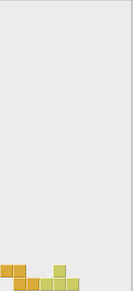

# ボード制御用プログラムで扱う情報

# ボード情報
ボード情報には以下が含まれます。<br>
詳細は[コード上](../../../board_controller.py)のGameStatusをログ出力することで確認可能です。

```
* field_info : フィールド情報
* block_info : ブロック情報
* judge_info : 審判情報
* debug_info : デバッグ情報
```

# フィールド情報

## フィールドの定義
幅10×高さ22ブロック分のフィールドを、一次元配列として定義しています。<br>
左上を原点(0,0)として、x軸は右側、y軸は下側を正の方向としています。<br>
配列の[x + y * 高さ]番目を指定して、座標データにアクセス可能です。<br>
<br>
|     |  フィールド  |  一次元配列  |
| --- | --- | --- |
| データ |  |  |

## フィールド情報に格納されているデータ

上記の一次元配列の各座標にブロックが有るか無いかを管理しています。

```
* `0以外` : ブロック有り
* `0` : ブロック無し
```

ブロックが有る場合は、各ブロックのIndex値を格納しています。<br>
Index値はブロック情報を参照下さい。

# ブロック情報

## ブロックの定義
ブロックは７種類あり、Index値と初期形状を以下の通り定義しています。<br>
横移動と回転が可能です。<br>
回転は時計回りに回転します。ブロックによって１周の回転に必要な回数が異なります。<br>

|     |  ShapeI  |  ShapeL  |  ShapeJ  |  ShapeT  |  ShapeO  |  ShapeS  |  ShapeZ  |
| --- | --- | --- | --- | --- | --- | --- | --- | 
| index値 | 1 | 2 | 3 | 4 | 5 | 6 | 7 | 
| 初期形状 |  |  |  |  |  |  |  | 
| １周の回転に必要な回数 | 2 | 4 | 4 | 4 | 1 | 2 | 2 | 

## ブロック情報に格納されているデータ

主に以下を格納しています。

* `現在のブロックのx座標とy座標`
* `現在のブロックのIndex値`
* `次のブロックのIndex値`

# 審判情報

以下を格納しています。

* `経過時間[s]` : ゲーム開始時からの経過時間
* `スコア[点]` : ゲーム開始時から現在までに獲得した合計スコア
* `ライン数` : ゲーム開始時から現在までに消したラインの数
* `ゲームオーバー回数` : ゲーム開始時から現在までにゲームオーバーになった回数

# デバッグ情報

以下等を格納しています。

* `スコア内訳` : 合計スコア（消したライン、落下ボーナス）の内訳

その他、詳細はコード上のGameStatusを参照下さい。

# 次の動作決定用のデータ

以下のデータを指定して次の動作を決定します。

* `direction` : 現在の形状から時計回りに回転する回数（範囲：0〜(1周の回転に必要な回数-1) ）
* `x` : x座標のどの位置に移動するか（範囲：0-9）
* `y_operation` : y座標方向の操作（0:移動、1:落下）
* `y_moveblocknum` : `y_operation=0`の場合に、y座標に何ブロック分移動するか（範囲：1-21）
